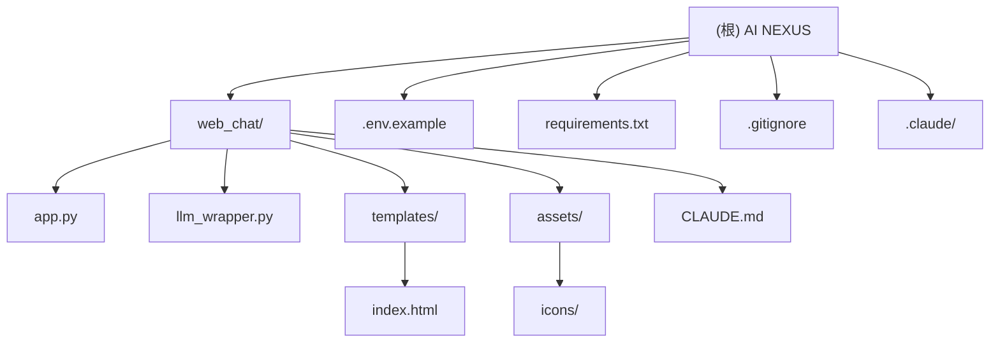

# CLAUDE.md

本文件为 Claude Code (claude.ai/code) 在此代码库中工作时提供指导。

---

## 变更记录 (Changelog)

### 2025-12-28 15:52:59
- **重大更新**: 重新初始化项目 AI 上下文
- 清理所有遗留文件（CLI 脚本、缓存、临时文件）
- 添加 `requirements.txt` 依赖管理
- 配置环境变量管理（`.env.example`）
- 创建 `.gitignore` 文件
- 修改 `llm_wrapper.py` 使用环境变量（安全实践）
- 生成根级与模块级 `CLAUDE.md` 索引

---

## 项目愿景

**AI NEXUS** 是一个**多模型 AI 聚合聊天 Web 应用程序**，旨在为开发者与用户提供统一、高效的 AI 交互界面。通过集成 Google Gemini、DeepSeek、Moonshot/Kimi、Qwen 和 Spark 五大主流 LLM 提供商，实现一站式智能对话体验。

### 核心价值
- **统一抽象**: 为不同 LLM 提供商提供一致的 API 接口
- **实时流式**: 支持所有模型的流式响应输出
- **安全优先**: 采用环境变量管理 API 密钥，确保敏感信息安全
- **独立对话**: 每个模型维护独立的对话历史记录

---

## 架构总览



### 技术栈
- **后端**: Python 3.x + Flask
- **前端**: 原生 JavaScript + TailwindCSS (CDN) + Marked.js
- **LLM SDK**: OpenAI SDK, Google GenAI SDK, 原生 HTTP (SSE)
- **依赖管理**: pip + requirements.txt
- **环境变量**: python-dotenv

---

## 模块索引

| 模块路径 | 类型 | 状态 | 职责描述 | 文档链接 |
|---------|------|------|---------|---------|
| `web_chat/` | Flask 应用 | 活跃 | Web 应用主模块，提供聊天界面与 API | [查看文档](./web_chat/CLAUDE.md) |

---

## 运行与开发

### 环境准备

#### 1. 安装依赖
```bash
# 使用 requirements.txt（推荐）
pip install -r requirements.txt

# 或手动安装
pip install flask requests openai google-genai python-dotenv
```

#### 2. 配置环境变量
```bash
# 复制环境变量模板
cp .env.example .env

# 编辑 .env 文件，填入您的 API 密钥
# 重要: .env 文件已被 .gitignore 忽略，不会被提交到版本控制
```

**必需的环境变量**:
```bash
# Google Gemini
GOOGLE_API_KEY=your_api_key_here

# DeepSeek
DEEPSEEK_API_KEY=your_api_key_here
DEEPSEEK_BASE_URL=https://api.deepseek.com/v1

# Moonshot / Kimi
MOONSHOT_API_KEY=your_api_key_here
MOONSHOT_BASE_URL=https://api.moonshot.cn/v1

# Qwen (通义千问)
QWEN_API_KEY=your_api_key_here
QWEN_BASE_URL=https://api.siliconflow.cn/v1/chat/completions

# Spark (讯飞星火)
SPARK_API_KEY=your_api_key_here
SPARK_BASE_URL=https://spark-api-open.xf-yun.com/v2/chat/completions
```

#### 3. 启动应用
```bash
# 进入 web_chat 目录
cd web_chat

# 启动 Flask 开发服务器
python app.py

# 访问地址
# http://127.0.0.1:5000
```

### 开发模式

```bash
# 启用 Flask 调试模式（自动重载）
export FLASK_DEBUG=1
python app.py

# 或修改 app.py 中的 app.run(debug=True, port=5000)
```

---

## 测试策略

### 当前状态
- **单元测试**: 未配置
- **集成测试**: 未配置
- **E2E 测试**: 未配置

### 测试建议

#### 后端测试
```bash
# 安装测试框架
pip install pytest pytest-flask pytest-cov

# 测试 LLMWrapper 的每个提供商方法
# 测试 Flask 路由的请求/响应
# 模拟 SSE 流进行集成测试
```

#### 前端测试
```bash
# 使用 Playwright 进行 E2E 测试
npx playwright install
npx playwright test
```

---

## 编码规范

### Python 代码规范
- **PEP 8**: 遵循 Python 官方代码风格指南
- **类型提示**: 为函数添加类型注解（优先）
- **文档字符串**: 使用 Google 风格的 docstring
- **异常处理**: 明确捕获和处理异常，提供有用的错误消息

### JavaScript 代码规范
- **现代 ES6+**: 使用 const/let、箭头函数、模板字符串
- **语义化命名**: 变量和函数名应清晰表达意图
- **注释**: 对复杂逻辑添加行内注释

### 安全规范
- **禁止硬编码**: 绝不在代码中硬编码 API 密钥或敏感信息
- **环境变量**: 所有配置通过环境变量或 `.env` 文件管理
- **输入验证**: 对用户输入进行验证和清理
- **错误处理**: 不在错误响应中暴露敏感信息

---

## AI 使用指引

### Claude Code 最佳实践

#### 1. 修改代码前
- **先读后写**: 使用 `Read` 工具理解现有代码
- **理解上下文**: 阅读相关模块的 `CLAUDE.md`
- **确认影响**: 评估修改对其他模块的影响

#### 2. 添加新功能
- **遵循架构**: 在现有架构内扩展，避免破坏抽象层
- **更新文档**: 修改代码后同步更新 `CLAUDE.md`
- **添加测试**: 为新功能编写测试用例

#### 3. 添加新的 LLM 提供商
1. 在 `llm_wrapper.py` 的 `configs` 中添加配置（使用环境变量）
2. 按照现有模式实现新的 `_chat_provider()` 方法
3. 在 `chat_stream()` 方法中添加路由分支
4. 在前端 `index.html` 的 `modelIcons` 中添加图标映射
5. 更新相关 `CLAUDE.md` 文档

#### 4. 调试技巧
- **Flask 日志**: 使用 `app.logger.debug()` 输出调试信息
- **流式响应**: 在 `llm_wrapper.py` 中使用 `print(..., flush=True)` 调试流
- **前端调试**: 使用浏览器开发者工具查看网络请求

---

## 项目结构

```
AgentUsing try/
├── web_chat/                    # Web 应用主模块
│   ├── app.py                   # Flask 应用入口
│   ├── llm_wrapper.py           # LLM 抽象层核心
│   ├── templates/
│   │   └── index.html           # 前端单页应用
│   ├── assets/
│   │   └── icons/               # 模型图标资源
│   │       ├── gemini_logo.svg
│   │       ├── deepseek_logo.svg
│   │       ├── kimi_logo.png
│   │       ├── qwen_logo.svg
│   │       └── spark_logo.svg
│   └── CLAUDE.md                # 模块文档
├── .claude/                     # Claude Code 配置
│   ├── index.json               # 项目索引
│   └── settings.local.json      # 本地设置
├── requirements.txt             # Python 依赖管理
├── .env.example                 # 环境变量模板
├── .gitignore                   # Git 忽略规则
├── .mcp.json                    # Model Context Protocol 配置
└── CLAUDE.md                    # 根级 AI 上下文文档（本文件）
```

---

## 常见问题 (FAQ)

### Q: 如何获取 API 密钥？
**A**: 各提供商获取方式：
- **Google Gemini**: https://makersuite.google.com/app/apikey
- **DeepSeek**: https://platform.deepseek.com/api_keys
- **Moonshot / Kimi**: https://platform.moonshot.cn/console/api-keys
- **Qwen**: https://siliconflow.cn/account/ak
- **Spark**: https://console.xfyun.cn/services/cbm

### Q: 为什么 Spark 模型没有对话历史？
**A**: Spark API 限制导致它不支持上下文记忆。每次请求仅发送当前用户消息，不传递历史记录。这是 API 级别的限制。

### Q: 如何在生产环境部署？
**A**:
1. 使用生产级 WSGI 服务器（如 Gunicorn）替代 Flask 开发服务器
2. 设置 `FLASK_ENV=production` 禁用调试模式
3. 使用系统环境变量而非 `.env` 文件
4. 配置反向代理（如 Nginx）
5. 启用 HTTPS

### Q: 如何自定义系统提示词？
**A**: 在 `llm_wrapper.py` 的模型配置中添加 `system` 字段：
```python
"deepseek": {
    "type": "openai",
    "api_key": os.environ.get("DEEPSEEK_API_KEY", ""),
    "base_url": os.environ.get("DEEPSEEK_BASE_URL", "https://api.deepseek.com/v1"),
    "model": "deepseek-chat",
    "system": "You are a helpful assistant"  # 自定义系统提示词
}
```

> 注意：仅 OpenAI 兼容的提供商（DeepSeek、Moonshot）支持通过配置设置系统提示词。

### Q: 如何处理流式响应中断？
**A**:
1. 检查网络连接稳定性
2. 确认 API 限流策略
3. 可添加超时重试机制：
```python
response = requests.post(url, json=payload, headers=headers, stream=True, timeout=30)
```

### Q: 前端如何支持 Markdown 渲染？
**A**: 前端使用 Marked.js 库自动渲染 Markdown：
```javascript
contentDiv.innerHTML = marked.parse(fullText);
```
支持：代码块、列表、链接、加粗等标准 Markdown 语法。

---

## 依赖清单

### 运行时依赖
- `flask>=3.0.0,<4.0.0` - Web 框架
- `requests>=2.31.0,<3.0.0` - HTTP 请求
- `openai>=1.0.0,<2.0.0` - OpenAI SDK（兼容 DeepSeek, Moonshot）
- `google-genai>=0.3.0,<1.0.0` - Google Gemini SDK
- `python-dotenv>=1.0.0,<2.0.0` - 环境变量管理

### 开发依赖（建议）
- `pytest` - 单元测试框架
- `pytest-flask` - Flask 测试工具
- `pytest-cov` - 测试覆盖率
- `black` - 代码格式化
- `flake8` - 代码检查
- `mypy` - 类型检查

---

## 相关资源

### 官方文档
- [Flask 文档](https://flask.palletsprojects.com/)
- [OpenAI Python SDK](https://github.com/openai/openai-python)
- [Google Genai SDK](https://github.com/googleapis/python-genai)
- [Marked.js](https://marked.js.org/)
- [TailwindCSS](https://tailwindcss.com/)

### 项目相关
- [项目根目录](.)
- [web_chat 模块文档](./web_chat/CLAUDE.md)
- [Claude Code 配置](./.claude/)

---

## 许可与版权

本项目仅供学习和研究使用。各 LLM 提供商的 API 使用需遵守其各自的服务条款。

---

*最后更新: 2025-12-28 15:52:59*
