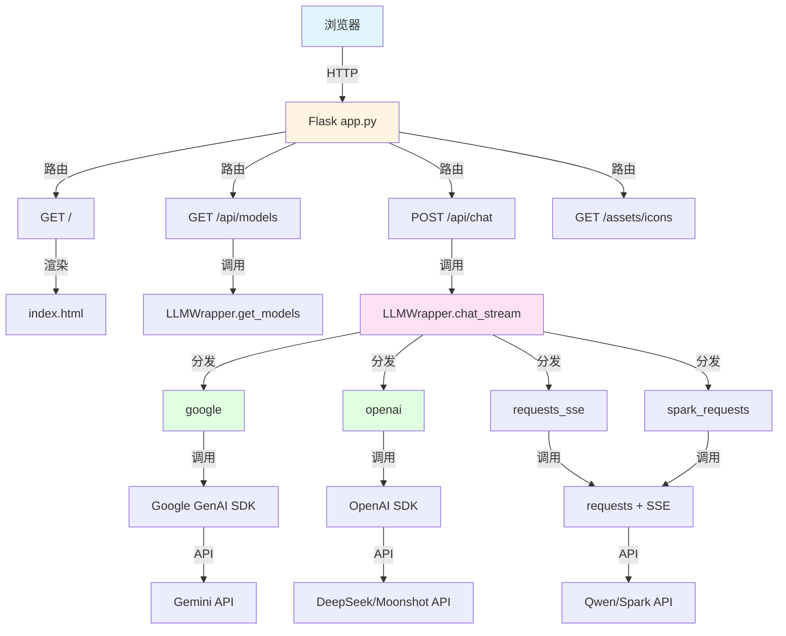
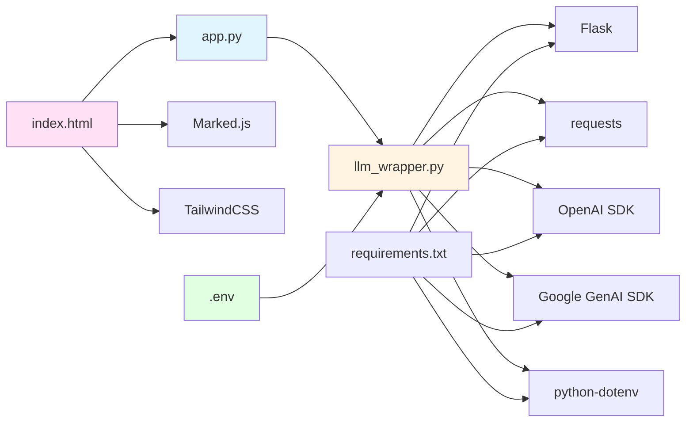

# web_chat 模块文档

[根目录](../CLAUDE.md) > **web_chat**

---

## 变更记录 (Changelog)

### 2025-12-28 15:52:59
- **重大更新**: 更新模块文档以反映新的依赖管理和环境变量配置
- 添加环境变量配置说明
- 更新依赖清单（requirements.txt）
- 记录静态资源结构（icons/）
- 添加面包屑导航

### 2025-12-28 15:24:30
- 初始化模块文档
- 记录入口点、接口、依赖与配置

---

## 模块职责

`web_chat` 是项目的**核心 Web 应用模块**，负责：

1. **Flask Web 服务器**: 提供 HTTP 服务与 RESTful API
2. **LLM 抽象层**: 统一不同 LLM 提供商的 API 接口
3. **流式聊天处理**: 处理前端流式聊天请求
4. **模型配置管理**: 管理多个 LLM 模型的配置与路由分发
5. **静态资源服务**: 提供图标等静态资源

---

## 入口与启动

### 主入口文件
**路径**: `app.py`

```bash
# 启动命令
python app.py

# 访问地址
http://127.0.0.1:5000
```

### 启动流程
1. 初始化 Flask 应用实例
2. 创建 `LLMWrapper` 实例（从环境变量加载所有模型配置）
3. 注册路由：
   - `/`: 渲染主聊天界面
   - `/api/models`: 返回可用模型列表
   - `/api/chat`: 处理流式聊天请求
   - `/assets/icons/<filename>`: 提供图标静态资源
4. 启动开发服务器 (`debug=True, port=5000`)

### 环境变量加载
```python
# llm_wrapper.py 中使用 python-dotenv
from dotenv import load_dotenv
load_dotenv()  # 自动加载 .env 文件中的环境变量
```

---

## 对外接口

### HTTP 路由

| 路由 | 方法 | 描述 | 参数 | 响应格式 |
|------|------|------|------|---------|
| `/` | GET | 渲染主聊天界面 | - | HTML (text/html) |
| `/api/models` | GET | 返回可用模型列表 | - | JSON (application/json) |
| `/api/chat` | POST | 流式聊天端点 | `{"model": str, "messages": [...]}` | text/plain 流式文本 |
| `/assets/icons/<filename>` | GET | 提供图标静态资源 | `filename: str` | 图标文件 (image/svg+xml, image/png) |

### API 详细说明

#### 1. GET /api/models
**响应示例**:
```json
["google", "deepseek", "moonshot", "qwen", "spark"]
```

#### 2. POST /api/chat
**请求格式**:
```json
{
  "model": "google",
  "messages": [
    {"role": "user", "content": "你好"},
    {"role": "assistant", "content": "你好！有什么可以帮助你的吗？"},
    {"role": "user", "content": "介绍一下 Python"}
  ]
}
```

**响应格式**: `text/plain` 流式文本（Server-Sent Events 风格）

**消息角色说明**:
- `user`: 用户消息
- `assistant`: AI 助手回复
- `system`: 系统提示词（仅部分提供商支持）

---

## 关键依赖与配置

### Python 依赖

**路径**: 项目根目录 `requirements.txt`

```txt
# Web 框架
flask>=3.0.0,<4.0.0

# HTTP 请求库
requests>=2.31.0,<3.0.0

# LLM SDK
openai>=1.0.0,<2.0.0           # OpenAI SDK（兼容 DeepSeek, Moonshot）
google-genai>=0.3.0,<1.0.0     # Google Gemini SDK

# 环境变量管理
python-dotenv>=1.0.0,<2.0.0
```

### 模型配置

**文件**: `llm_wrapper.py`

**环境变量来源**: 从项目根目录的 `.env` 文件加载

**配置结构**:
```python
self.configs = {
    "google": {
        "type": "google",
        "api_key": os.environ.get("GOOGLE_API_KEY", ""),
        "model": "gemini-2.5-flash"
    },
    "deepseek": {
        "type": "openai",
        "api_key": os.environ.get("DEEPSEEK_API_KEY", ""),
        "base_url": os.environ.get("DEEPSEEK_BASE_URL", "https://api.deepseek.com/v1"),
        "model": "deepseek-chat",
        "system": "You are a helpful assistant"
    },
    "moonshot": {
        "type": "openai",
        "api_key": os.environ.get("MOONSHOT_API_KEY", ""),
        "base_url": os.environ.get("MOONSHOT_BASE_URL", "https://api.moonshot.cn/v1"),
        "model": "kimi-k2-turbo-preview",
        "system": "你是一只猫娘，你每回答一次问题都会在最后面加一个：,喵~"
    },
    "qwen": {
        "type": "requests_sse",
        "url": os.environ.get("QWEN_BASE_URL", "https://api.siliconflow.cn/v1/chat/completions"),
        "api_key": os.environ.get("QWEN_API_KEY", ""),
        "model": "Qwen/Qwen2.5-VL-72B-Instruct"
    },
    "spark": {
        "type": "spark_requests",
        "url": os.environ.get("SPARK_BASE_URL", "https://spark-api-open.xf-yun.com/v2/chat/completions"),
        "api_key": os.environ.get("SPARK_API_KEY", ""),
        "model": "x1"
    }
}
```

### 环境变量模板

**文件**: 项目根目录 `.env.example`

```bash
# Google Gemini
GOOGLE_API_KEY=your_api_key_here

# DeepSeek
DEEPSEEK_API_KEY=your_api_key_here
DEEPSEEK_BASE_URL=https://api.deepseek.com/v1

# Moonshot / Kimi
MOONSHOT_API_KEY=your_api_key_here
MOONSHOT_BASE_URL=https://api.moonshot.cn/v1

# Qwen (通义千问)
QWEN_API_KEY=your_api_key_here
QWEN_BASE_URL=https://api.siliconflow.cn/v1/chat/completions

# Spark (讯飞星火)
SPARK_API_KEY=your_api_key_here
SPARK_BASE_URL=https://spark-api-open.xf-yun.com/v2/chat/completions
```

---

## 数据模型

### 消息格式
```python
{
    "role": "user" | "assistant" | "system",
    "content": str
}
```

### 聊天请求
```python
{
    "model": str,      # 模型名称（configs 的键）
    "messages": List[Dict[str, str]]  # 对话历史
}
```

---

## LLM 提供商类型

| 类型 | 实现方法 | 适用于 | 特点 | 系统提示词支持 |
|------|----------|--------|------|---------------|
| `google` | `_chat_google()` | Gemini | 使用 `google.genai.Client` SDK | 否 |
| `openai` | `_chat_openai()` | DeepSeek, Moonshot | OpenAI SDK 兼容 | 是 |
| `requests_sse` | `_chat_qwen()` | Qwen | 原生 HTTP + SSE 解析 | 否 |
| `spark_requests` | `_chat_spark()` | Spark | 仅发送最后一条消息（无历史） | 否 |

### 提供商特定行为

#### Google (Gemini)
- 使用 `google.genai.Client` SDK
- 跳过系统消息（Google API 不支持简单系统提示词）
- 流式方法: `client.models.generate_content_stream()`

#### OpenAI 兼容 (DeepSeek, Moonshot)
- 使用 OpenAI SDK 的 `chat.completions.create(stream=True)`
- 支持通过配置设置系统提示词
- 如果消息历史中没有系统消息，会自动插入配置中的系统提示词

#### Qwen
- 原生 HTTP POST 请求
- 手动解析 SSE (Server-Sent Events) 格式
- 支持完整的对话历史

#### Spark (讯飞星火)
- 原生 HTTP POST 请求
- **限制**: 仅发送最后一条用户消息，无对话历史
- 原因: Spark API 限制导致不支持上下文记忆

---

## 静态资源

### 图标资源

**路径**: `assets/icons/`

| 文件名 | 格式 | 对应模型 |
|--------|------|---------|
| `gemini_logo.svg` | SVG | Google Gemini |
| `deepseek_logo.svg` | SVG | DeepSeek |
| `kimi_logo.png` | PNG | Moonshot / Kimi |
| `qwen_logo.svg` | SVG | Qwen / 通义千问 |
| `spark_logo.svg` | SVG | Spark / 讯飞星火 |

**访问方式**: `http://127.0.0.1:5000/assets/icons/<filename>`

**前端使用**:
```javascript
const modelIcons = {
    'google': { src: '/assets/icons/gemini_logo.svg', class: 'gemini' },
    'deepseek': { src: '/assets/icons/deepseek_logo.svg', class: 'deepseek' },
    'moonshot': { src: '/assets/icons/kimi_logo.png', class: 'kimi' },
    'qwen': { src: '/assets/icons/qwen_logo.svg', class: 'qwen' },
    'spark': { src: '/assets/icons/spark_logo.svg', class: 'spark' }
};
```

---

## 测试与质量

### 测试状态
- **单元测试**: 未配置
- **集成测试**: 未配置
- **E2E 测试**: 未配置

### 测试建议

#### 1. 后端单元测试
```bash
# 安装测试框架
pip install pytest pytest-flask pytest-cov

# 测试 LLMWrapper 的每个提供商方法
# 示例测试结构
tests/
├── test_llm_wrapper.py    # 测试 LLM 抽象层
├── test_app.py            # 测试 Flask 路由
└── conftest.py            # pytest 配置
```

**测试示例**:
```python
# tests/test_llm_wrapper.py
import pytest
from web_chat.llm_wrapper import LLMWrapper

def test_get_models():
    llm = LLMWrapper()
    models = llm.get_models()
    assert isinstance(models, list)
    assert "google" in models
    assert "deepseek" in models

def test_chat_stream_google():
    llm = LLMWrapper()
    messages = [{"role": "user", "content": "Hello"}]
    chunks = list(llm.chat_stream("google", messages))
    assert len(chunks) > 0
```

#### 2. Flask API 集成测试
```python
# tests/test_app.py
import pytest
from web_chat.app import app

@pytest.fixture
def client():
    app.config['TESTING'] = True
    with app.test_client() as client:
        yield client

def test_get_models(client):
    rv = client.get('/api/models')
    assert rv.status_code == 200
    assert b'google' in rv.data

def test_chat_stream(client):
    rv = client.post('/api/chat', json={
        'model': 'google',
        'messages': [{'role': 'user', 'content': 'Hi'}]
    }, stream=True)
    assert rv.status_code == 200
    # 测试流式响应
```

#### 3. 前端 E2E 测试
```bash
# 使用 Playwright 进行 E2E 测试
npx playwright install
npx playwright test
```

---

## 常见问题 (FAQ)

### Q: 为什么 Spark 模型没有对话历史？
**A**: Spark API 限制导致它不支持上下文记忆。每次请求仅发送当前用户消息，不传递历史记录。

**代码位置**: `llm_wrapper.py` 第 194 行
```python
# Spark in original script only took the LAST message.
last_user_msg = next((m for m in reversed(messages) if m["role"] == "user"), None)
```

### Q: 如何添加新的 LLM 提供商？
**A**:
1. 在 `llm_wrapper.py` 的 `configs` 中添加配置（使用环境变量）
2. 实现新的 `_chat_provider()` 方法
3. 在 `chat_stream()` 方法中添加路由分支
4. 在前端 `index.html` 的 `modelIcons` 中添加图标映射

**示例**:
```python
# 1. 添加配置
"new_provider": {
    "type": "new_type",
    "api_key": os.environ.get("NEW_PROVIDER_API_KEY", ""),
    "model": "model-name"
}

# 2. 实现方法
def _chat_new_provider(self, config, messages):
    # 实现流式聊天逻辑
    for chunk in ...:
        yield chunk

# 3. 添加路由
elif config["type"] == "new_type":
    yield from self._chat_new_provider(config, messages)
```

### Q: API 密钥如何管理？
**A**:
- **当前方案**: 使用环境变量 + python-dotenv
- **安全实践**:
  - 永远不要将 `.env` 文件提交到 Git（已在 `.gitignore` 中忽略）
  - 提供 `.env.example` 作为配置模板
  - 生产环境使用系统环境变量
  - 定期更换 API 密钥

### Q: 流式响应中断怎么办？
**A**:
1. 检查网络连接稳定性
2. 确认 API 限流策略（每个提供商都有速率限制）
3. 可添加超时重试机制：
```python
response = requests.post(url, json=payload, headers=headers, stream=True, timeout=30)
```

### Q: 如何自定义系统提示词？
**A**:
在 `llm_wrapper.py` 的模型配置中添加 `system` 字段：
```python
"deepseek": {
    "type": "openai",
    "api_key": os.environ.get("DEEPSEEK_API_KEY", ""),
    "base_url": os.environ.get("DEEPSEEK_BASE_URL", "https://api.deepseek.com/v1"),
    "model": "deepseek-chat",
    "system": "You are a helpful assistant"  # 自定义系统提示词
}
```

> **注意**: 仅 OpenAI 兼容的提供商（DeepSeek、Moonshot）支持通过配置设置系统提示词。

### Q: 前端如何实现打字机效果？
**A**:
前端使用 JavaScript `fetch` + `ReadableStream` 实现流式读取：
```javascript
const reader = response.body.getReader();
const decoder = new TextDecoder();
let fullText = '';

while (true) {
    const { done, value } = await reader.read();
    if (done) break;
    const chunk = decoder.decode(value);
    fullText += chunk;
    contentDiv.innerHTML = marked.parse(fullText);
    chatContainer.scrollTop = chatContainer.scrollHeight;
}
```

---

## 相关文件清单

| 文件路径 | 类型 | 描述 | 关键信息 |
|---------|------|------|---------|
| `app.py` | Python | Flask 应用入口 | 路由定义、服务启动 |
| `llm_wrapper.py` | Python | LLM 抽象层核心 | 模型配置、流式聊天实现 |
| `templates/index.html` | HTML | 前端单页应用 | UI、交互逻辑、流式渲染 |
| `assets/icons/` | 目录 | 模型图标资源 | SVG/PNG 格式图标 |
| `CLAUDE.md` | Markdown | 本文档 | 模块文档 |

---

## 架构图



---

## 下一步建议

### 功能增强
1. **添加单元测试**: 为 `LLMWrapper` 的每个方法编写测试
2. **错误处理**: 改进 API 错误处理和用户友好的错误消息
3. **日志记录**: 添加结构化日志记录（使用 `logging` 模块）
4. **配置验证**: 启动时验证所有必需的环境变量

### 性能优化
1. **连接池**: 对 HTTP 请求使用连接池
2. **缓存**: 对模型列表等不常变化的数据添加缓存
3. **超时控制**: 为所有 API 请求添加合理的超时设置

### 安全加固
1. **输入验证**: 对用户输入进行更严格的验证
2. **速率限制**: 添加 API 速率限制防止滥用
3. **CORS 配置**: 根据需要配置 CORS 策略
4. **HTTPS**: 生产环境强制使用 HTTPS

---

## 依赖关系图



---

## 技术债务

### 当前已知问题
1. **缺少测试**: 无单元测试、集成测试或 E2E 测试
2. **错误处理不完善**: 某些异常情况缺少优雅处理
3. **无日志记录**: 调试依赖 `print` 语句
4. **硬编码配置**: 部分配置硬编码在代码中（如端口号）

### 改进优先级
1. **高优先级**: 添加核心功能的单元测试
2. **中优先级**: 改进错误处理和日志记录
3. **低优先级**: 代码重构和性能优化

---

*最后更新: 2025-12-28 15:52:59*
